# ETL Income Statement

## Table of Contents

- [Project Overview](#project-overview)
- [What is an Income Statement?](#what-is-an-income-statement)
- [Key Steps of an ETL](#key-steps-of-an-etl)
- [Fact and Dimension Tables](#fact-and-dimension-tables)
- [Understanding the Project Data](#understanding-the-project-data)
- [Creating the Virtual Environment](#creating-the-virtual-environment)
- [Installing Required Libraries](#installing-required-libraries)
- [Configuring Jupyter Notebook](#configuring-jupyter-notebook)
- [Configuring Jupyter Lab](#configuring-jupyter-lab)
- [Connecting to the SQL Server Database](#connecting-to-the-sql-server-database)
- [First ETL Step: Extract](#first-etl-step-extract)
- [Second ETL Step: Transform](#second-etl-step-transform)
- [Third ETL Step: Load](#third-etl-step-load)
- [Creating the ETL Class](#creating-the-etl-class)
- [Creating the ETL.py File](#creating-the-etlpy-file)
- [Creating the requirements.txt File](#creating-the-requirementstxt-file)
- [Automating the ETL with Windows Task Scheduler](#automating-the-etl-with-windows-task-scheduler)
- [Connecting Power BI to the Database](#connecting-power-bi-to-the-database)
- [Modeling and Relationships of the Model](#modeling-and-relationships-of-the-model)
- [Income Statement Analysis](#income-statement-analysis)
- [Conclusion and Next Steps](#conclusion-and-next-steps)

# Project Overview

> Many companies, both in Brazil and worldwide, are still stuck with manual methods to extract and process data from their ERP systems. Imagine, for example, the task of creating an annual report: the user needs to extract a report for each month, manually process the data, and finally consolidate 12 separate files to generate the annual report. Now, multiply that by the last 5 years. The time and effort involved are immense, not to mention the risk of manual errors.
>
> To solve this challenge, I developed a project that automates this entire process. Using Python, I created an ETL (Extract, Transform, Load) pipeline that, with just one click, performs all the necessary steps to generate an Income Statement (DRE) from CSV reports.
>
> **How It Works:**

1.  **Extraction:** The script automatically loads financial data from the CSV files.

2.  **Transformation:** Transformation rules are applied to ensure the data is consistent and ready for analysis.

3.  **Load:** The transformed data is stored in a relational database, centralizing the information for easy access and management.

4.  **Visualization:** A dashboard is developed in Power BI to display the results.

> **Advantages:**

-   **Centralized and Secure Management:** The database facilitates the maintenance and updating of information, ensuring data integrity and security.

-   **Faster Queries:** With structured data, queries in Power BI are quicker, avoiding long wait times when loading data.

-   **Scalability:** The solution is easily scalable, supporting increased data volumes without compromising performance.

-   **Increased Operational Efficiency:** Automation reduces the time and effort required for data processing, eliminating manual errors and increasing productivity.

# What is an Income Statement?

When we talk about business management, the Income Statement is one of the most crucial reports. After all, every company wants to know if its operations are generating the expected results. While the cash flow shows how much money the company has at a given time, the Income Statement measures operational performance.

There are two main types of Income Statements: Accounting and Managerial. In this project, I will focus on the Managerial Income Statement, but first, let's understand the main difference between them.

**Accounting Income Statement:**

-   **Compliance with Legal Requirements:** The Accounting Income Statement is designed to meet tax and legal requirements.

-   **Compliance with Accounting Standards:** It strictly follows accounting principles, ensuring transparency and accuracy for external stakeholders such as investors and the government.

-   **Based on Double-Entry Accounting:** Every transaction involves a debit and a credit. For example, a sale might result in a revenue credit and a cash or accounts receivable debit if the sale is on credit.

**Managerial Income Statement:**

-   **Focus on Internal Management:** This version of the Income Statement is intended for internal use, especially for managers who need to make quick and informed decisions.

-   **Targeted Analysis:** It emphasizes specific analyses that help in business management and strategy without the need to follow debit and credit norms.

# Key Steps of an ETL

ETL (Extract, Transform, Load) is a process that involves extracting data from various sources, transforming that data to be ready for analysis, and finally loading it into a database or other storage system.

In the context of this project, the main steps follow the traditional structure of an ETL process:

1.  **Data Loading (Extract):**

    -   Reading and storing the CSV files in a SQL Server database.

2.  **Data Transformation (Transform):**

    -   Implementing in Python the transformations and treatments that were previously performed in Power Query.

3.  **Loading into the Database (Load):**

    -   Inserting the transformed data into the SQL Server database, ready to be consumed by Power BI.

# Fact and Dimension Tables

Fact tables are tables that store the history of business events, such as sales or transactions, and typically have a date column. They connect to dimension tables through **foreign keys** (a field in one table that refers to the primary key of another table, creating a link between the two tables).

Dimension tables complement the information in fact tables by providing details such as product names or locations. They use **primary keys** (a unique field in a table that uniquely identifies each record, ensuring there are no duplicates).

Together, these tables enable detailed analysis by linking the history of events to their descriptions.

# Understanding the Project Data

Let's now briefly explore the data used in this project. The exported files are organized in a specific folder, containing data for three years: 2022, 2023, and 2024. Each file follows a naming convention that facilitates identifying the entries by year and type of account. For example, the file `fLancamento1_ano1` contains all entries related to account types 01.xx.xx for the year 2022, while `fLancamento2_ano2` refers to accounts of type 02.xx.xx for the year 2023, and so on.

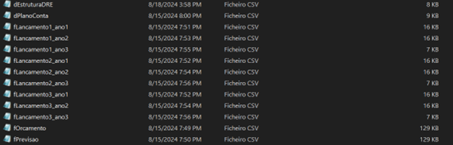

To better illustrate, here are the main tables used in the project:

**Table: dEstruturaDRE**

**Type: Dimension**

-   **id:** Unique identifier that combines a group code with the managerial account number.

-   **index:** Numeric index that defines the sequential order of managerial accounts.

-   **contaGerencial:** Name of the managerial account that describes specific types of income, expenses, or results.

-   **subtotal:** Indicator that signals whether the row represents a subtotal or final calculated value.

-   **empresa:** Name of the company or location to which the financial data refers.

**Table: dPlanoConta**

**Type: Dimension**

-   **id:** Unique identifier that combines the hierarchical code with the specific row number of the description.

-   **index:** Numeric index that defines the sequential order of items within the description.

-   **descricaoN1:** Level 1 description that specifies the general type of transaction or category.

-   **descricaoN2:** Level 2 description that provides further or more specific detail of the transaction.

-   **detalharN2:** Binary indicator that shows whether there is additional detail (0 for no detail, 1 for detail).

-   **mascaraDRE_id:** Reference to the DRE mask identifier, associating the row with a specific DRE category.

-   **tipoLancamento:** Type of entry that indicates the nature of the transaction, with values like 1 for addition and -1 for subtraction.

**Table: fOrcamento**

**Type: Fact**

-   **competencia_data:** Competency date indicating the period to which the transaction or value refers.

-   **planoContas_id:** Account plan identifier that associates the value with a specific category within the accounting.

-   **valor:** Monetary value recorded for the specific transaction or account on the indicated competency date.

**Table: fPrevisao**

**Type: Fact**

-   **competencia_data:** Competency date indicating the accounting period to which the recorded values refer.

-   **planoContas_id:** Account plan identifier that classifies the nature of the transaction or accounting item.

-   **valor:** Monetary amount associated with the specific account on the indicated competency date.

**Tables: fLancamento1_ano1 / fLancamento2_ano1 / fLancamento3_ano1**

**Type: Fact**

-   **competencia_data:** Competency date indicating the accounting period to which the recorded values refer.

-   **planoContas_id:** Account plan identifier that classifies the nature of the transaction or accounting item.

-   **valor:** Monetary amount associated with the specific account on the indicated competency date.

# Creating the Virtual Environment

Creating a virtual environment is essential to isolate the packages used in a project, ensuring that library versions are consistent and avoiding the notorious "works on my machine" problem. At the end of the project, a `requirements.txt` file is generated, listing all the libraries installed in that environment. This allows the script to be executed in any environment consistently, as long as the `requirements.txt` is used.

To create the virtual environment, I use Windows PowerShell. Here are the steps I follow:

**Navigate to the Project Folder:**

-   First, I navigate to the folder where my project is located. To do this, I use the `cd` command followed by the project folder path.

-   Then, I run the following command to create the virtual environment.

-   I replace `"environment_name"` with the name I want to give the virtual environment.

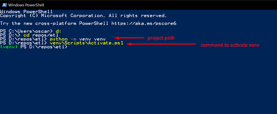

Now, all the packages I install will be isolated in this environment.

**[If You Face Issues Running Python Commands:](#)**

If I can't run Python commands in PowerShell, it may be necessary to add Python to the Windows environment variables. To do this:

-   I type "variables" in the Windows search bar and select "Edit the system environment variables."

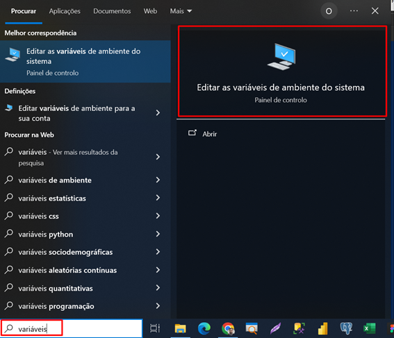

-   In the window that appears, I click "Environment Variables..."

And then "Edit..."

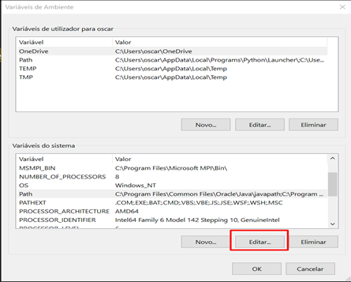

Lastly, I click "New" and add the path where Python is installed on my computer.

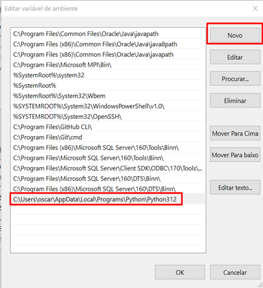

# Installing Required Libraries

Now I will install the libraries needed to perform the ETL process. For this, I use Jupyter Notebook or Jupyter Lab as the IDE, which are the interfaces where I write and run my code. Additionally, I need `pandas`, a powerful data manipulation library, and `pyodbc`, which I will use to connect to a SQL Server instance. As the project progresses, I will install other libraries as needed.

To install, I use the following commands:

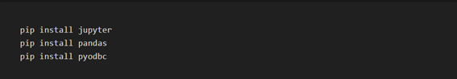

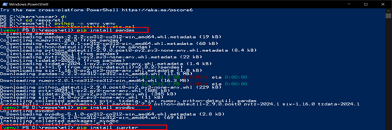

# Configuring Jupyter Notebook

An IDE, or Integrated Development Environment, is a tool that combines different features such as a code editor, debugger, and terminal to facilitate software development. In the case of Jupyter Notebook, the web interface acts as the IDE where I write and run my code.

To open Jupyter Notebook, I use the command:

After execution, the terminal shows me two URLs where I can access Jupyter Notebook, in addition to automatically opening a notebook with the default URL. To open Jupyter Notebook, I usually need to copy this URL and paste it into the browser.

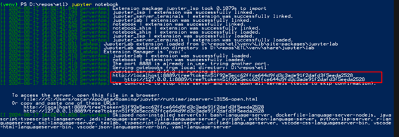

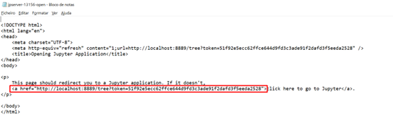

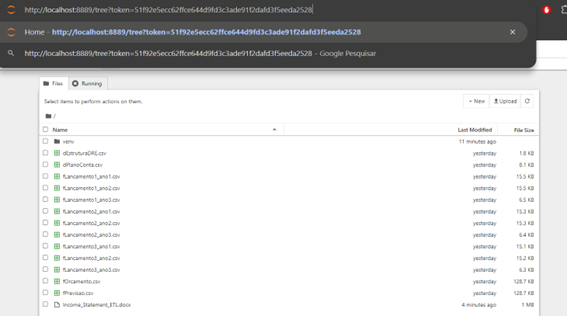

However, I prefer to automate this process so that Jupyter Notebook opens directly in Google Chrome, which is the browser I'm using. To do this, in PowerShell, I run a command to generate the Jupyter configuration file. This file is created in the `.jupyter` folder, which in my case is located at `C:\Users\oscar\.jupyter`.

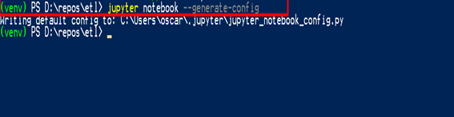

To edit the configuration file, I open it with Notepad.

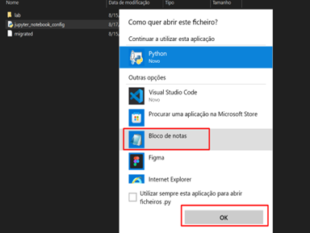

Once open, I use `Ctrl + F` to search for the following text: `c.ServerApp.browser`.

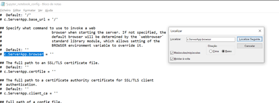

Then, I remove the comment (symbol `#`) and enclose in single quotes (`' '`) the path where Chrome is installed on my machine. In my case, Chrome is located at `"C:\Program Files\Google\Chrome.exe"`. After that, I save the file and run Jupyter Notebook again.

**[Note:](#)** When copying the Chrome path, I replaced the backslashes (`\`) with double backslashes (`\\`), or you can replace them with forward slashes (`/`). Additionally, add a space and `'%s'` after the path in double quotes. For example:

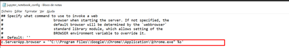

Also, I checked if Chrome is in the Windows environment variables (since I'm using Windows).

After following these steps, Jupyter Notebook will automatically open in Google Chrome.

# Configuring Jupyter Lab

Another widely used IDE is Jupyter Lab. It offers significant advantages over Jupyter Notebook, such as real-time collaboration, a sidebar with a file manager, and the ability to collapse code cells, which greatly improves readability. These features make Jupyter Lab an attractive choice for more complex projects.

In this specific project, I will choose to use Jupyter Lab, mainly because of its interface options and the sidebar, which allow me to have better control of the files and a more organized view of my work. These tools provide a more efficient and pleasant development environment, especially when dealing with multiple files and tasks.

To install Jupyter Lab:

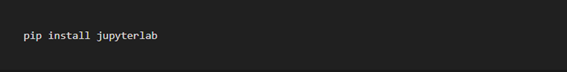

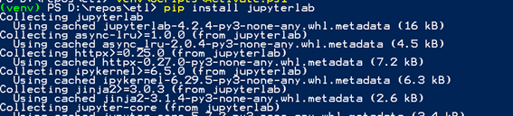

After installation, just launch it:

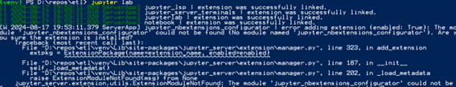

**Using the virtual environment inside Jupyter Lab**

To use the virtual environment created in the previous steps, I first need to install the Jupyter Lab kernel within the virtual environment. To do this:

And now I install the environment inside Jupyter Lab with the command:

Once this is done, just launch Jupyter Lab and select the virtual environment within the interface. I go to Change Kernel > and select the newly created Kernel.

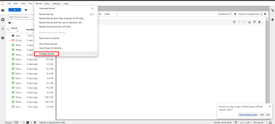

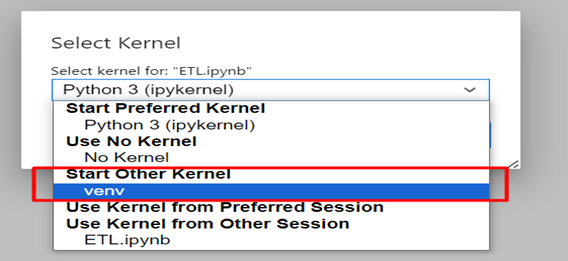

If I did everything correctly, I can see the virtual environment in use in the project in the top right corner of the notebook; in my case, the virtual environment I created earlier is `venv`.

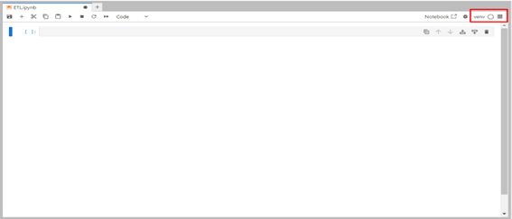

# Connecting to the SQL Server Database

In this step, I will connect to a local (on-premises) database using the `pyodbc` library. In my case, I will not provide the DATABASE parameter as I intend to create the database using `pyodbc`.

Thus, I will only pass the driver and the server and will connect directly to the SQL Server master instance. Next, I will create the database connection, create a cursor, and finally close the cursor and connection.

The cursor is a `pyodbc` object that basically executes SQL queries. The official documentation reference is at the following link:

<https://learn.microsoft.com/en-us/sql/connect/python/pyodbc/step-3-proof-of-concept-connecting-to-sql-using-pyodbc?view=sql-server-ver16>

Steps:

1 -- Test the connection

2 -- Create a cursor

3 -- Close the cursor and connection

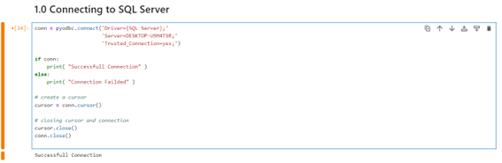

# First ETL Step: Extract

We have reached the first step of our ETL process, which is data extraction to load them into a database. With the SQL Server connection open, the first step is to check if the necessary database already exists. If it doesn't exist, I will create it. Next, I will check if the tables I need to load are already present in the database; if not, I will create them.

Summary of steps:

1 -- Check if there is a database named ETL created; if it does not exist, create it;

2 -- Check if the table I want to load exists; if not, create it;

3 -- Repeat the steps for all files.

1 -- Step 1: Check if there is a database named ETL created; if it does not exist, create it.

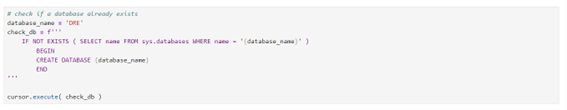

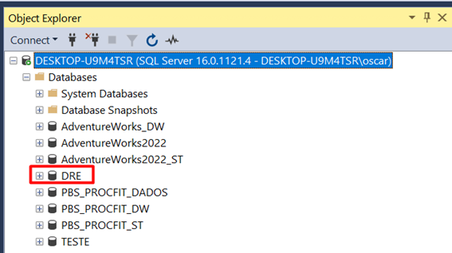

After executing the command below, a database named DRE was created in the local SQL Server instance. This ensures that even if the database is accidentally deleted, the ETL will continue to execute, as we will always have the creation of a database if it does not exist.

2 -- Step 2: Check if the table I want to load exists; if not, create it.

In this step, I will need to install `sqlalchemy` to read the table and automatically create it in the database if it does not exist. For this, I will use a pandas method called `to_sql`.

Installing `sqlalchemy` and importing the `create_engine` function:

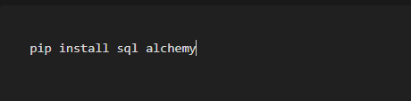

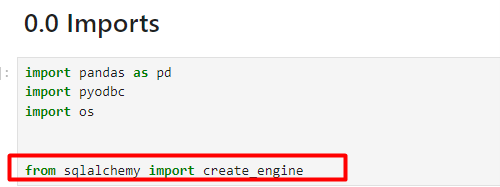

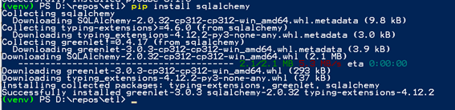

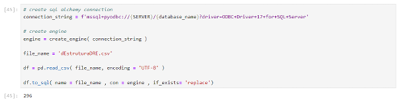

First, I created the connection string similar to the one created earlier in `pyodbc`.

After that, I created the engine, which is the `sqlalchemy` object that connects to SQL Server, and after reading the file, I used the pandas `to_sql` method to insert the read table directly into the database. The `if_exists = 'replace'` parameter replaces the already existing data with each execution.

As we can see in the following image, the table was loaded but brought several blank rows. In the extraction step, I will not worry about data and table transformation; I will leave that for Step 2 of the ETL: Transform.

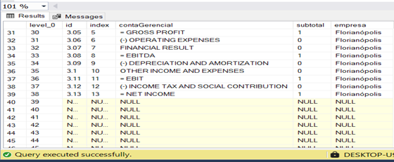

3 -- **Step 3**: Repeat the steps for all files. In this step, I will load all the tables that exist within the folder.

To do this, I will loop through all the files and load the CSV files into the database.

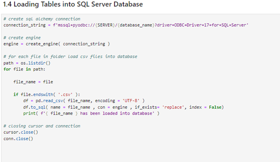

As we can see in the following image, all the CSV files were loaded into the DRE database.

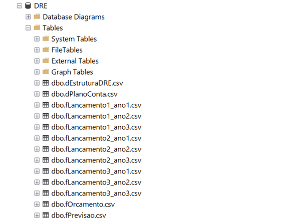

To make the code more organized and easier to maintain, I will encapsulate all the data extraction steps within a function called `extract()`. This not only improves code clarity and reusability but also allows some steps to be dynamically configured through parameters, making the process more flexible.

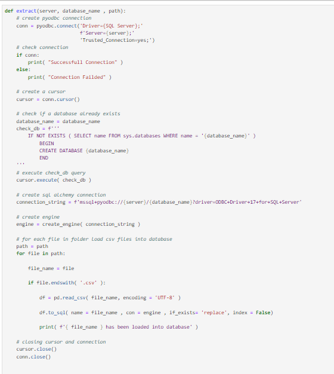

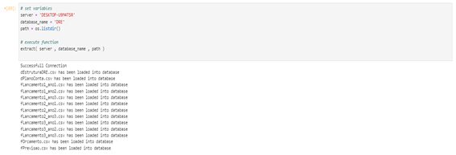

# Second ETL Step: Transform

The second step of ETL is data transformation.

In this step, I will check the data types, handle null values, and perform transformations when necessary.

I will use the transformations applied in Power Query as a reference and replicate them in Jupyter Lab. Finally, I will encapsulate all the steps within a function and proceed to the next step: Load.

I will start with the `dEstruturaDRE` table. The applied steps were as follows:

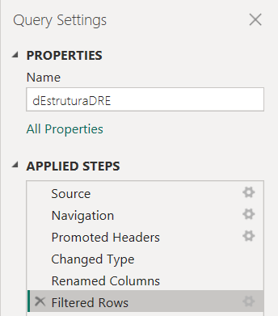

1 -- **Promoted Headers**: The first row was used as the header. I will skip this step because the data was already loaded with the correct header.

2 -- **Changed Type**: Shows how the data types were defined.

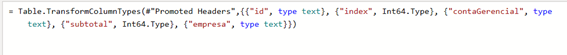

3 -- **Renamed Columns**: The columns were renamed to English.

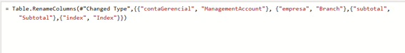

4 -- **Filtered Rows**: Here, null values were handled by filtering the `id` column to exclude null and empty values.

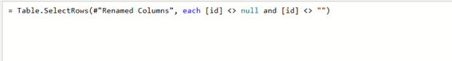

Now I will apply the same transformations in pandas:

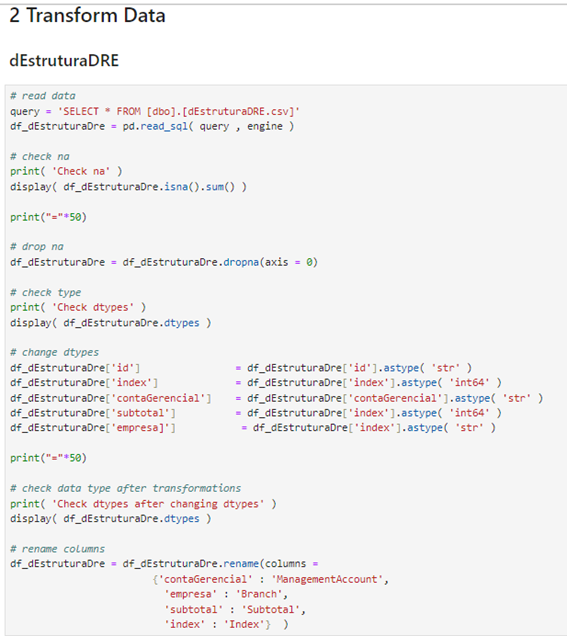

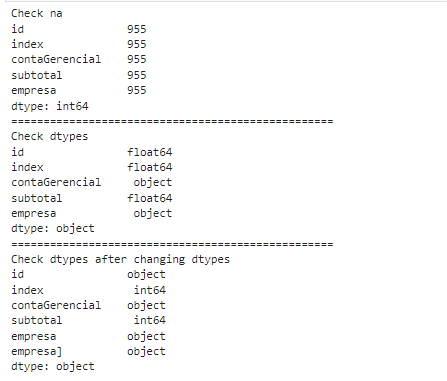

**Table `dPlanoConta`:**

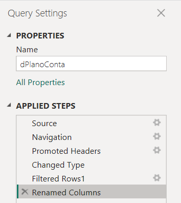

1 -- **Promoted Headers**: As done earlier, I will skip this step.

2 -- **Changed Type**: Data typing as in the following image:

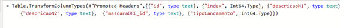

3 -- **FilteredRows1**: Removal of null values.

4 -- **Renamed Columns**: Columns renamed from Portuguese to English.

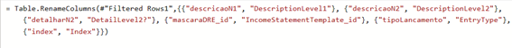

Applying the same transformations in pandas:

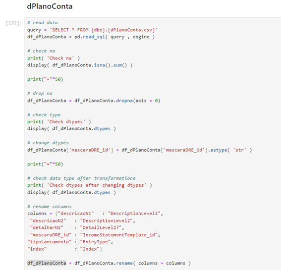

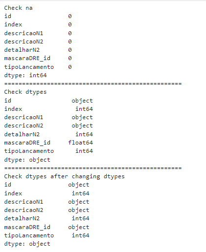

**Table `fOrcamento`:**

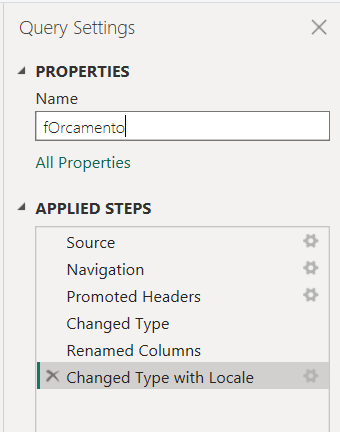

1 -- **Promoted Headers**: Step not necessary.

2 -- **Changed Type**: Data typing as follows:

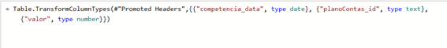

3 -- **Renamed Columns**: Rename the columns as follows:

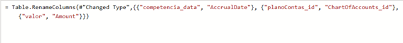

4 -- **Change Type with Locale**: Change the date according to the local date.

Applying the transformations in pandas:

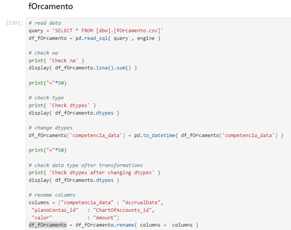

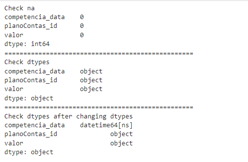

**Table `fPrevisao`**

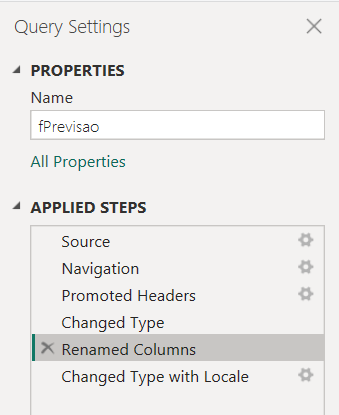

1 -- **Promoted Headers**: I skipped this step because pandas read it correctly.

2 -- **Changed Type**: Data typing as follows:

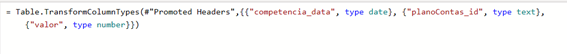

3 -- **Renamed Columns**: Rename columns as follows:

4 -- **Changed Type with Locale**: Change the date to the local format.

Applying the transformations in pandas, I encountered an error.

**Resolving Error When Converting Numeric Text Values to Float**

**The Problem:**

The values had decimal separators as "." (period), but in Python, the period is the default decimal separator. However, the presence of multiple periods in numeric values led to conversion errors.

**The Solution:**

To solve this, I needed to replace the last period (which separates the decimal places) with a temporary character, such as `#`. Then, I replaced the other periods with an empty string (`""`), and finally, I changed the `#` back to `.` so that Python correctly recognized the decimal separator.

I used the `apply` function along with a lambda function, applying the `rpartition` method to perform this replacement. `rpartition` splits a string into three parts based on the last separator found. This is useful because it allows me to correctly identify and manipulate the decimal separator.

**Example of `rpartition`:**

When I applied `rpartition`, it split the string at the last period, as shown below:

**Another Challenge:**

I noticed that some integer values in the dataset were not in the format `xxx.00`; for example, the number 987. If I did not address this case, these integer numbers could be misinterpreted as decimals during conversion, causing errors.

Because when adding the integer numbers, they would become decimal values as shown below:

**The Solution for Integer Values:**
I applied a rule to format integer numbers as `xxx.00` before making the replacements, ensuring that the conversion to float was accurate.

Applying the steps in pandas would look like this:

Basically, `rpartition` splits the string into a tuple, and with slicing `[::2]`, I take all the elements of the tuple, ignoring the decimal separator. Then, I use `join` to concatenate the temporary character `#` with the other parts of the tuple. Finally, I make the necessary replacements so that Python can correctly convert to float.

**`fLancamentos` Tables**

For the `fLancamentos` tables, I will first treat one, and since they all have the same structure, I can replicate the same treatment for the others through a `for` loop.

The main treatments are:

1 -- **Changes Type**: Data typing;

2 -- **Renamed Columns**: Rename the columns

3 -- **Filtered Rows1**: Remove null values

4 -- **Changed Type with Locale**: Change the date according to the local format.

Performing the same steps in pandas:

**Automating the Treatment**

After performing the treatment on all tables, I will create a function that encapsulates all the data treatment and transformation steps.

The great advantage of this approach is ease of maintenance: if new tables are added to the folder, just include the specific treatment for that table within the function.

Additionally, to make the function more dynamic, I will allow the user to specify any folder path. This ensures that if the files change location, the ETL process will not be affected.

The complete function can be seen in the `ETL_DRE.py` file.

Basically, the function loops through all the files in a folder and performs the necessary treatment according to the name. After the treatment, the tables are inserted into a list and returned by the function.

# Third ETL Step: Load

The last step of ETL is data loading. In this step, I created a function that loads the treated and transformed data into a database specified by the user.

The main steps are:

1 -- Activate the SQL Server database connection:

2 -- Process the data:

3 -- Create the new database where the processed data will be stored:

4 -- Load the processed data:

5 -- Creating the Load function:

Testing the function:

# Creating the ETL Class

After creating and individually testing the ETL functions, it is time to organize everything into a class. Using a class allows structuring the code in a cleaner and more efficient way, with functions defined for each task. In this specific ETL, the class helps avoid code redundancy, such as the need to create the same database connection function multiple times.

When initializing the class, the database connection is automatically established and inherited by all methods. This not only simplifies the code but also ensures that the connection is consistently reused in all ETL operations.

Another great benefit is that I can create multiple ETL instances with different servers and folder paths. Simply copy the class and adjust the parameters as needed, making the process highly flexible and reusable.

The complete class can be seen in the `ETL_DRE.py` file.

# Creating the ETL.py File

After creating the class, it's time to create the `ETL.py` file that will be used to automate the entire ETL.

Creating it is quite simple, just open a new Python File and copy the used libraries, the class, and run the ETL methods, namely: `extract`, `transform`, `load`.

To run the file, I open the PowerShell terminal, navigate to the project folder, activate the virtual environment, and use the command below:

If everything goes well, the ETL will execute all the steps. The printed messages above help to understand where any errors might occur.

# Creating the requirements.txt File

After testing the ETL and confirming that it is working correctly, it is important to ensure that others can reproduce the project on their own machines. To do this, I will export all the libraries and dependencies used in the project to a `.txt` file.

To do this, in the PowerShell terminal, I navigate to the project folder and type the following commands:

This will create a `requirements.txt` file in the project directory, which contains the list of all the libraries and specific versions used.

This file is typically included in GitHub repositories, allowing anyone who clones the repository to easily recreate the environment needed to run the ETL on their local machine. It's important to note that some parameters, such as the database server, will need to be adjusted according to each user's individual setup.

# Automating the ETL with Windows Task Scheduler

To schedule the ETL execution via Windows Task Scheduler, follow these steps:

1 -- Type "Task Scheduler" in the Windows search or "Task Scheduler" (European Portuguese).

2 -- After opening the program, click "Create Basic Task":

3 -- Name the task and provide a brief description:

4 -- Choose the frequency of execution:

5 -- Choose the time and how often to repeat:

6 -- Click "Start a Program" and click next:

7 -- In step 1, enter the path where the `python.exe` file is installed within the virtual environment used in the project. In item 2, enter the name of the file to be executed, and item 3 is the project folder.

8 -- Done! Now just click Finish, and the task will be scheduled.

9 -- To test the task, on the initial panel, click the task and then click Run. If everything goes well, a terminal will open, and a script will execute.

**Note**: The Windows Task Scheduler only works if the computer is on. So, in a scenario where there is a local server, for example, that runs 24/7, it might be interesting to run the script locally. Otherwise, there are other scheduling libraries, such as `scheduler`, that work even with the computer off.

# Connecting Power BI to the Database

With the data already processed and transformed in the database, we just need to connect to the database and bring in the tables. To do this:

1 -- In the Power BI start menu, go to SQL Server.

2 -- Enter the server and database name. In my case, the server is local, so I enter `localhost`, and the database name I want to access is `DRE_Cleaned`.

3 -- After that, I have access to the database tables.

4 -- Now, just select and go to "Transform Data." Theoretically, the data is already processed and typed, so we wouldn't need to add steps in Power Query, making data loading faster.

# Modeling and Relationships of the Model

In the project, different CSV files are related to each other, forming the basis for the data model. Here is an explanation of how these relationships work:

**`dEstruturaDRE.csv` has a 1:\* (one-to-many) relationship with `dPlanoConta.csv`:**

-   This means that each record in `dEstruturaDRE.csv` can be related to multiple records in `dPlanoConta.csv`. In other words, `dEstruturaDRE.csv` acts as a filter for `dPlanoConta.csv` through the `id` field.

**`dPlanoConta.csv` has a 1:\* relationship with `fLancamentos.csv`:**

-   Here, `dPlanoConta.csv` also filters the records in `fLancamentos.csv`. A single record in `dPlanoConta.csv` can be associated with many records in `fLancamentos.csv`.

**`dPlanoConta.csv` has a 1:\* relationship with `fPrevisao.csv`:**

-   Similarly, `dPlanoConta.csv` filters `fPrevisao.csv`, where a record in `dPlanoConta.csv` can correspond to multiple records in `fPrevisao.csv`.

**`dPlanoConta.csv` has a 1:\* relationship with `fOrcamento.csv`:**

-   Again, `dPlanoConta.csv` filters `fOrcamento.csv`, with the possibility of a record in `dPlanoConta.csv` being associated with multiple records in `fOrcamento.csv`.

**Final Model:**

The resulting data model is known as a **snowflake**, where we have two normalized dimension tables: `dPlanoConta.csv` and `dEstruturaDRE.csv`. Unlike the **StarSchema** model, where the fact tables connect directly to dimensions without sub-levels of normalization, the snowflake model offers a more detailed and segmented structure.

# Income Statement Analysis

The Income Statement I am analyzing is from a chain of stores in three states: São Paulo, Rio de Janeiro, and Florianópolis. With that in mind, I thought of some strategic questions I would ask if I were the business owner, and how these questions could be visually answered in the dashboard. The key questions are:

1.  **How is the group's performance?**\
    (Considering the group as the sum of the three stores.)

> 

2.  **How is the individual performance of each store?**

> 

3.  **Monthly, is what was planned being achieved or not?**

> 

4.  **Can I evaluate how EBITDA or another indicator is varying over the months?**

> 
>
> 

5.  **Of everything we sold, how much gross margin do I have to cover fixed expenses?**

> 

6.  A consolidated view that I can toggle between horizontal and vertical analysis?

# Conclusion and Next Steps

This project demonstrated how automating the ETL process using Python and Power BI can transform how companies manage and analyze their financial data. By automating the extraction, transformation, and loading of data for an Income Statement, we were able to create a robust and scalable solution that not only improves operational efficiency but also provides valuable insights for strategic decision-making.

Using Jupyter Lab and a class structure in Python facilitated the organization and maintenance of the code, ensuring that the process is replicable and adaptable to different business contexts and needs. Additionally, the snowflake data modeling allowed for detailed and structured information analysis, optimizing query performance in Power BI.

To check the dashboard click on this [link](https://app.powerbi.com/view?r=eyJrIjoiYzc0ZTY5NDQtNDg3OS00MjExLWFjMmQtZTg0ZjYwMDNlMWJkIiwidCI6ImYwZGU2ZTJmLWFiZTgtNGQ1OS05Yzc1LWU4ODdhMTUwN2IxYiIsImMiOjl9)

-   **Expanding the Dashboard:**\
    Expand the Power BI dashboard to include more KPIs (key performance indicators) that can help identify trends, such as profitability analysis by product or market segment.

-   **Implementing Automated Alerts:**\
    Add an automated alert system that notifies the user when certain indicators, such as EBITDA or gross margin, reach critical or unexpected values.
